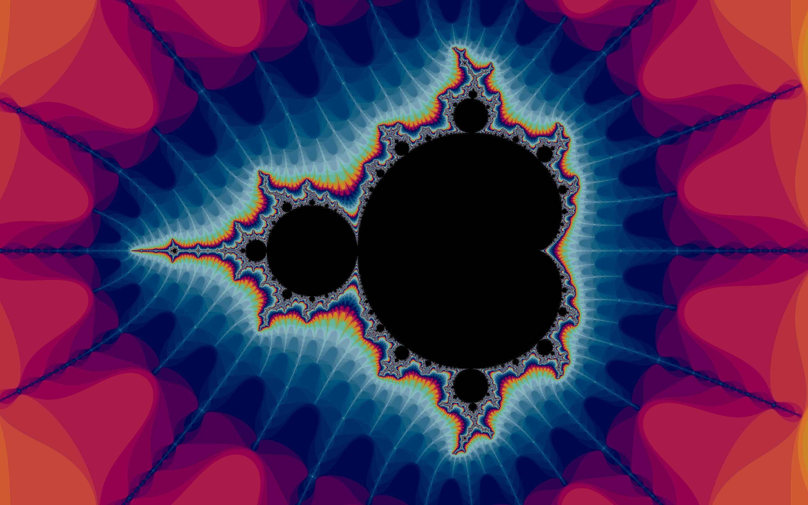
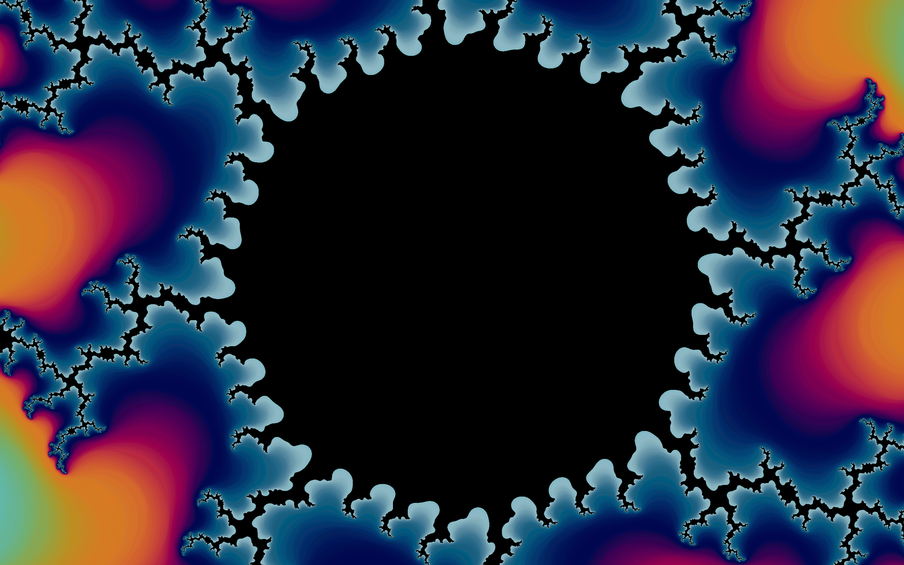
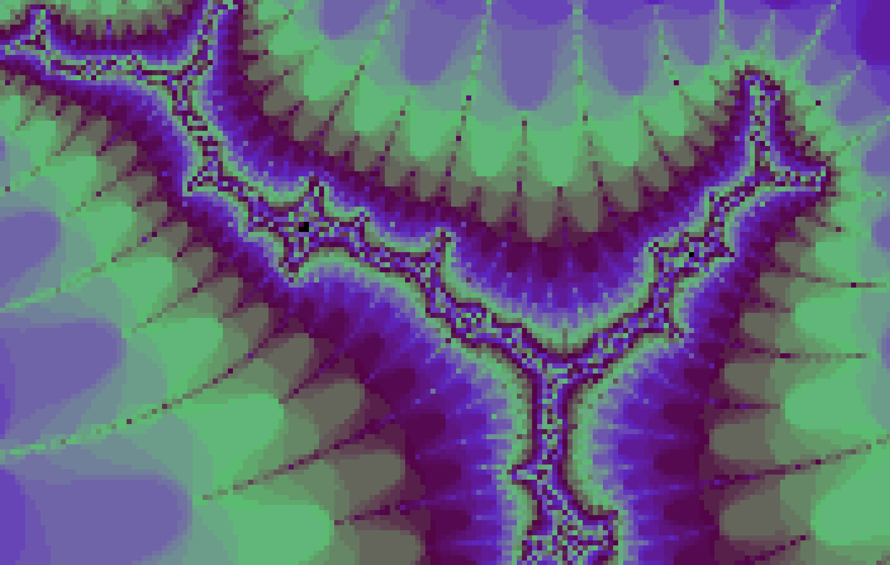

# Fractal Generator

## What Are Fractals?

To put it simply fractals are mathematical shapes containing infinite detail.
This detail can be achieved In many different ways. Some fractals are self similar.
Some never repeat. Mandelbrot set is Quasi self similar.
This means that after you zoom in far enough you will find copies of the original set,
they will never be identical thought, this can be seen in the image above
(this is one of the copies found in the "tip" on the negative real number line)

## How is it generated?

Mandelbrot set is a fractal that lives in the realm of [complex numbers](https://en.wikipedia.org/wiki/Complex_number).
Each pixel on the screen is assigned a number based on its position.
Horizontal axis is responsible for the real part while Vertical axis is responsible for imaginary part.
Once a pixel is assigned it's number $c$ We define a series
$$z_{n+1} = z_{n}^{2} + c$$
$$z_{0} = 0$$
If this series diverges to infinity this pixel is colored if it stays low it is colored black.

## Where do the colors come from?

If the $|z| > 4$ we can be sure that the series diverges, we can therefore stop the computation and get the iteration count.
In order to smooth out the gradient the $|z|$ is taken into account.
Using this data, color is calculated using a [CIELAB or CIELCh](https://en.wikipedia.org/wiki/CIELAB_color_space) color space.

## What distinguishes this app from a typical fractal generator?

In order for computers to calculate quickly some sacrifices had to be made.
In most programming languages there are two options for calculating real numbers:

1.  float - 32 bit representation of a number
2.  double - 64 bit representation of a number

for most cases, this is more than enough. You can zoom in quite far before you run out of precision,
but wether you use floats or doubles sooner or later you will run out of precision.
This program uses a custom number representation:
Each number is represented by a list of integers,
Think of it like digits in our daily number representation,
for example 1.256 would be represented by [1,2,4,6].
For this case numbers are centered around 1 so we can assume the dot is always after the first number.
Typical long addition, subtraction and multiplication algorithms can be applied.
Numbers of type int can be much larger than 10 so the numbers are not base 10, they are base 46300.
Obviously this comes with a cost, computers are optimized to multiply numbers in float format, not this kind of format,
This makes this kind of representation slower.

### How does this program fight computation time?

#### Real time rendering

Each frame only a tiny amount of iterations are made per pixel,
this means that even thought the whole frame can take a few seconds to render,
the program will always run smooth and never stutter.

#### Salvaging information from previous renders

When you decide to move the image, data about already generated pixels is preserved.

#### Quick resolution control

If you want to dive deep into the fractal rendering each image on the way in full resolution is time consuming.
3 buttons can help you with that:

- I immediately zooms in while decreasing render resolution
- U starts upcasing the image behind the scene and gradually puts it on screen
- O immediately zooms out increasing render resolution

## Features

### Implemented

- Mandelbrot Set
- Infinite zoom (Not really because of the build times e-100 should be possible in current version)
- Various performance enhancements
- Simple gui

### Planned

- Other fractals
- better gui
- performance boost
- fixing known bugs
- finding unknown bugs

## Gallery

  
  
  

  
  

  
  

